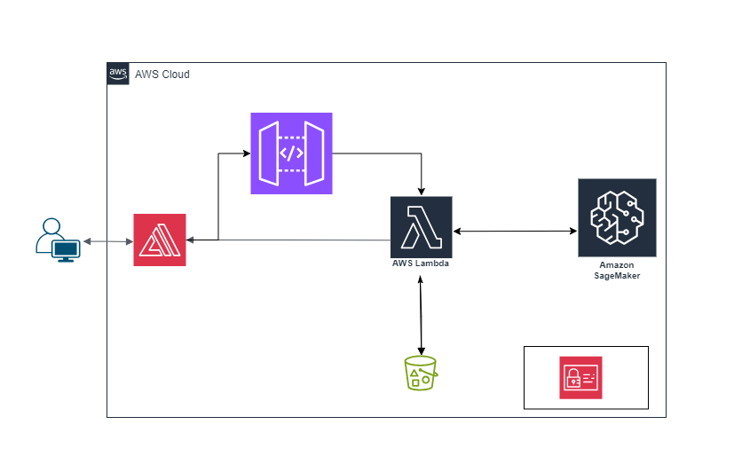

# AWS Sagemaker based Visual Search Solution

This project showcases the visual search capabilities of [Amazon Sagemaker Canvas](https://aws.amazon.com/sagemaker/canvas/).

## Overview
Here we use Single-label image prediction - Build models using image datasets to predict single or multiple categories for image classification problems.

### :hammer_and_wrench: Setup
* Configuring IAM Roles
### :computer: Creating the Dataset
### Build and Train Models
### Deploying the model

## Architecture
 
## Versioning